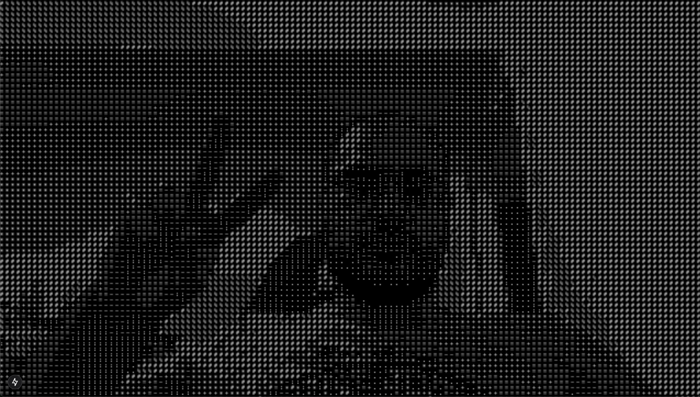

# Webcam ASCII

A real-time webcam feed converter that transforms your camera input into ASCII art. Built with Next.js, React, and TypeScript.

## Demo

Check it out [https://webcam2ascii.vercel.app/](https://webcam2ascii.vercel.app/)



## Features

- Real-time webcam capture
- Dynamic ASCII art conversion
- Responsive design
- Dark mode support
- Monospace font optimization

## Tech Stack

- Next.js 15
- React 19
- TypeScript
- Tailwind CSS
- react-webcam

## Getting Started

1. Clone the repository:

```bash
git clone https://github.com/fac3m4n/webcam2ascii.git
```

2. Install dependencies:

```bash
npm install
```

3. Start the development server:

```bash
npm run dev
```

4. Open your browser and navigate to `http://localhost:3000` to see the app in action.

## How It Works

The application captures frames from your webcam in real-time and processes them through the following steps:

1. Captures video frames using react-webcam
2. Converts each frame to a canvas element
3. Processes the image data to calculate brightness values
4. Maps brightness values to ASCII characters
5. Renders the ASCII art on the canvas

The ASCII conversion uses a character set from darkest to lightest: ` .:-=+*#%@`

## Configuration

You can customize the ASCII output by modifying the following parameters in the WebcamAscii component:

- Character set for ASCII conversion
- Character width and height
- Font size and style

## Browser Support

The application requires:

- A modern browser with WebRTC support
- Camera/webcam access permissions
- JavaScript enabled

## License

This project is licensed under the MIT License. See the [LICENSE](LICENSE) file for details.
## Contributing

Contributions are welcome! Please feel free to submit a Pull Request.